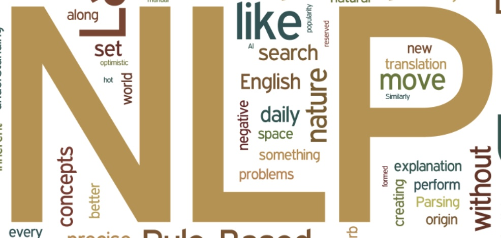

Title: 中国トップ研究者による自然言語処理の入門者へのアドバイス
Date: 2019-04-25 00:00
Category: Research
slug: advice-for-nlp-novice
Cover: images/nlp.jpeg

  

スタンフォード大学の博士課程を卒業、対話モデル・強化学習の応用等の分野で多大な成果を残し、現在では中国の自然言語処理スタートアップ [Shannon.ai](http://www.shannonai.com/) をリードする [Jiwei Li (李纪为)氏](https://nlp.stanford.edu/~bdlijiwei/)による、[「自然言語処理に入門する際のちょっとしたアドバイス (初入NLP领域的一些小建议)」](https://zhuanlan.zhihu.com/p/59184256)と題された記事がありましたので、内容を簡単に紹介します。

私もこの分野でかれこれ10年以上、研究開発に携わっていますが、彼のアドバイスには同意するところが多いです。どちらかと言えば、修士・博士課程の学生のような、「自然言語処理の研究に入門する人」を対象に書かれた文章ですが、それ以外、例えば、業務で自然言語処理を使うような方にも有用なアドバイスが多くあります。

彼のような優秀な研究者でも、「PRML を途中で投げ出した」ような体験談が語られているところ、私達にも親近感が持てますね。個人的には、近年の中国と中国系研究者の躍進によって、中国語でこのような良質な第一次情報がどんどん出始めたという点も感慨深いです。

---

自然言語処理は、今や人工知能の中でも非常に重要な分野の一つになった。

誰もが TensorFlow や PyTorch で簡単にモデルを書けるようになった今、多くの研究者がデータセット上でのベンチマークを更新することに躍起になっている。モデルを実装するのが簡単になった分、最高精度を更新するのも簡単ではなく、新規性が無く論文が通らないか、通ってもインパクトを残せない。

深層学習の普及によって、アルゴリズムそのものに注目が集まりすぎ、モデルのアーキテクチャの改善が多数提案され、それについて語るのが格好良いこととなった今、重要なことがいくつか見逃されているように感じる。これまで自身が経た紆余曲折やはまった落とし穴に基づいて、このアドバイスを結論として書いた。自然言語処理の分野に入門する人々の助けとなれば幸いである。

## NLP の基礎を理解する

[Jurafsky & Martin の Speech and Language Processing](https://web.stanford.edu/~jurafsky/slp3/) は、この分野の古典的教科書である。NLP の基礎知識や、基本的なタスクと解決の道筋が示されている。全てを完全に理解する必要はないが、NLP を全体的に理解するのに非常に重要である。

[Chris Manning の Introduction to Information Retrieval](https://nlp.stanford.edu/IR-book/information-retrieval-book.html) も、知らない部分を補足する意味で良い本だ。細かいところを全て覚える必要はないが、概要を覚えておく。情報検索と自然言語処理の分野には共通点が多い。

NLP の基礎を理解するのがなぜ重要か。いくつか例を挙げる。

例えば、LSTM や transformer で言語モデルを作る時にも、バイグラム・トライグラムの言語モデルをベースラインとして実装するのは重要だ。ニューラルネットのモデルにバグがあるのか、パラメータのチューニングがいまいちなのかが分かる。
ただ、バイグラムやトライグラムの言語モデルでは、OOV (out-of-vocabulary) によるスムージング問題があり、多くの初心者がここで多くの時間を無駄にする。ラプラス平滑化やKneser-Ney平滑化を知っているかが分かれ目となる。

もう一つの例が、BERT 言語モデルの訓練時における単語のランダム置換だ。単語のランダム置換とは何か、そもそもなぜ結果が良くなるのか。実は、それ以前に Ziang Xie の論文 [Data Noising as Smoothing in Neural Network Language Models](https://arxiv.org/pdf/1703.02573.pdf) において、この方法が初めて提案されており、その理論的な解釈も与えられている。このようなランダム置換は言語モデルの補完平滑化と関連があるが、これは上記 Jurafsky & Martin の本の 3.4.3 節で既に解説されている。

## 早期の NLP モデルと論文を理解する

近年のニューラルネットモデルと比べると、早期のモデルは複雑に感じるかもしれないが、データや計算機資源などが少なかった時代の研究者の知恵が詰まっている。これらのモデルをしっかり理解することで、今のニューラルネットにおいても精通することができる。

以前、著者のセミナーで、だいたいで良いので IBM モデル 1 が手で書ける人が居るかどうかを聞いたのだが、30〜40人の参加者の中に一人も居なかった。IBM モデルや階層的フレーズベースの機械翻訳は、近年の比較的引用数の多い論文の元になっていることも多い。例えば：

* [Chris Dyer のアラインメントが双方向で一致する制約を使う話](https://arxiv.org/abs/1601.01085)。これは、2006年にPercy Liang の [Alignment by Agreement](https://cs.stanford.edu/~pliang/papers/alignment-naacl2006.pdf) で提唱された考えと全く同じである。 
* 対話システムで、生成文章→原文の逆向き確率を使ってリランキングする方法。この考えはニューラル翻訳以前にも、MERT を使ったリランキングなどで広く使用されていた。
* EMNLP 2016 のベストペーパー候補 [Sequence-to-Sequence Learning as Beam-Search](https://arxiv.org/pdf/1606.02960.pdf)は、 [Daume III & Marcu の LaSO モデル](https://www.isi.edu/~marcu/papers/daume05laso.pdf)をニューラルに適用したものである。

さらに遡れば、ニューラル機械翻訳の分野で誕生したアテンション（注意機構）も、IBM モデルのニューラルネット版と言えるのではないか。

## 機械学習の基本モデルを理解する

ニューラルネットは強力だが、研究という意味では、基本的な機械学習アルゴリズムを知っておくのは必須である。例えば、Andrew Ng の機械学習のコースは必修である。

最近、私が面接した候補者の話だ。短い時間でトップ会議にも投稿しているが、EM アルゴリズムを聞いたことが無いという。「自分の研究に必要ない」とのことであるが、これは私が思うに大きな間違いである。

以前の自分のことを考えてみても、同じような損をしていたことを思い出す。以前は数学の基礎が弱く、変分法に関するアルゴリズムを見ただけで頭が痛くなっていた。このような知識の偏りが長く続くことによって、自身の研究の幅を狭めていた。例えば、CRF の推論などは確かに比較的複雑であるが、これを理解するのは NLP 研究者の教養と言ってもよい。

[パターン認識と機械学習 (Pattern Recognition and Machine Learning; PRML)](https://www.maruzen-publishing.co.jp/item/b294524.html) は、特に難しい節などもあって、途中で投げ出したことが何度もあるし、完全に理解できていないところもある。それでも、基礎的な章も多く、読み通す価値がある。２〜３人の学習グループを作って重要な章だけを１〜２年でひととおり読み通すのがオススメである。

NLP は応用科学であって、特別な数学は必要ないが、毎日使っているようなアルゴリズム、例えば、ドロップアウト、SGD やモーメンタム、AdaGrad などの最適化手法、バッチ正則化、レイヤー正則化などの数学を理解しておくのは重要である。

ここ数年、クラスメートのバグを潰す手伝いをしている時、訓練時にドロップアウトを適用し、テスト時に出力値をドロップアウト確率の逆に応じてスケールするのを忘れていたのを３〜５人見たことがある。ドロップアウトの確率を上げれば上げるほど性能が下がるばかりか、当の本人は、なぜそれが必要かを知らなかったのである。ドロップアウトの背景となる数学を理解していないとこのようなことが起こる。

## NLP の他のサブ分野の論文を読む

NLP には機械翻訳・情報抽出・構文解析・機械読解などの多くのサブ分野がある。これらのサブ問題に詳しくなっておくことは重要だ。
他の分野は、問題の定式化が異なるので最初は難しく感じるが、実際使われているモデルには大差がない。他の分野に詳しい友人・同僚などに聞いてみるのも良い。

## 隣接分野の重要な進歩について知っておく 

コンピューター・ビジョン（画像認識）やデータ・マイニングの各分野の重要な進歩について知っておくのは、研究の視野を広げるのに重要だ。

技術用語の使い方、書き方のスタイル、基礎知識の欠如などにより、最初に他分野の論文を読むのは難しいかもしれない。自分にも、ディスカッション・グループで faster-RCNN について間違って話してしまった経験がある。

NLP 分野の重要な論文は、画像認識の分野における思想に影響を受けている。そのまた逆の状況も起きている。NLP の可視化や解釈性の研究は、画像認識の CNN の可視化に遅れをとっている。GAN も元はといえば画像認識の分野で発展したものだ。文書理解タスクにおけるスパン抽出は、画像検出と基本的に同じである。画像キャプション生成は、Sequence-to-Sequence モデルと大きな違いは無い。強化学習、Actor-Critic モデルもしかり。

他領域の理解は難しいので、チュートリアルを見るのであれば疑似コードがあるようなものが望ましい。知らない部分を補強する意味で、[Stanford CS231n（画像認識のための畳み込みニューラルネットワーク）](http://cs231n.stanford.edu/) のようなコースのビデオを見るのも良い。NLPグループに画像認識が分かる人が居る（またその逆）という状況も重要だ。

グラフ埋め込みは、データ・マイニングの分野で最近盛り上がっているが、NLPでも多くのタスクに応用され始めている。グラフの節点に対して埋め込みを学習する [DeepWalk](http://www.perozzi.net/publications/14_kdd_deepwalk.pdf) は word2vec に基づいており、またそれが NLP の分野に還元されつつあるように見える。

なお、どのようにして論文を書くか、というのも重要な点であるが、本文章のトピックではない。[清華大学の劉知遠教授の書かれたこの文章](https://zhuanlan.zhihu.com/p/58752815)を強くオススメしておく。
