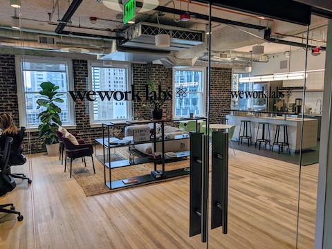
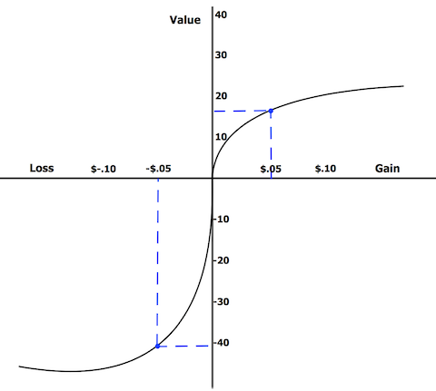
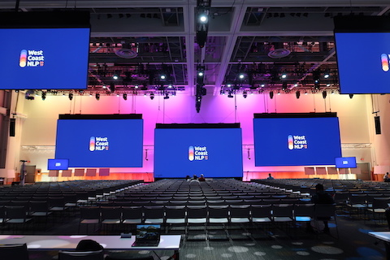

Title: 米国でAIフリーランスとして独立して1年が経った
Date: 2020-06-10 00:00
Category: Career
slug: my-first-year-as-a-freelance-ai-engineer
Cover: images/wework.jpg

この記事は、私が米国で AI フリーランスとして独立してからちょうど一年が経った 2020年2月 に書いた [My First Year as a Freelance AI Engineer
](http://masatohagiwara.net/202002-my-first-year-as-a-freelance-ai-engineer.html) という記事を、自分で日本語に翻訳し、その後数ヶ月に起こったことを踏まえて加筆・訂正したものである。

<figure style="text-align: center">
	
	<figcaption>シアトルにある WeWork Labs</figcaption>
</figure>

## はじめに

今週をもって、フルタイムの仕事を退職し、ML（機械学習）と NLP（自然言語処理）を専門とするエンジニア・研究者（以下では単に「AI エンジニア」と呼ぶ）として[独立して](http://masatohagiwara.net/blog/leaving-startup-and-becoming-independent.html)からちょうど１年が経った。これまでのところ、独立してとても良かったと思っているし、自分の仕事人生の中でもかなり生産的な１年だったと思う。ここ１年で、以下をはじめとする様々な成果を上げることができた：

* 書籍 [“Real-Word Natural Language Processing”](https://www.manning.com/books/real-world-natural-language-processing) の執筆と出版
* [TEASPN](https://www.teaspn.org/)、[NanigoNet](https://github.com/mhagiwara/nanigonet)、[Github Typo Corpus](https://github.com/mhagiwara/github-typo-corpus)、[Open Language Profiles](https://www.openlanguageprofiles.org/) などのオープンソースや研究関係の NLP プロジェクト
* [マルチタスク・転移学習を使った超多クラス固有表現抽出システムの開発](http://masatohagiwara.net/files/201911_TAC_KBP.pdf)（これは、[Studio Ousia](https://www.ousia.jp/) さんとのプロジェクトであり、TAC-KBP 2019 という国際コンペで第2位にランクインした）
* [AllenNLP 入門コースの開発](https://twitter.com/mhagiwara/status/1196851043021144065)（AllenNLP の開発チームと共同。数ヶ月以内にローンチ予定）
* 他、クライアントの非公開プロジェクト多数

この１年間の経験から、「フリーランスの AI エンジニア」というのはキャリアパスとして十分に成り立つものだということが分かったが、万人に勧められるものでもないということも体感した（これについては後述する）。多くの知人・友人が、フリーランスとしてのキャリアに興味を持ってくれたし、そもそも自分も含め、「フリーランスの AI エンジニア」というものの存在をそもそも聞いたこともないという人が多数だった。なんとなくでも興味がある人のために、こうして自分の経験や考えを記しておきたいというのがこの記事を書いたきっかけだ。

## フリーランスに向く人・向かない人

「フリーランスになるべきか」と問われたら、その答えはほとんどの人にとって「ノー」だと思う。フリーランスとしての生き方は万人には向かない。ただ、フリーランスであることを楽しめるようなタイプの人であれば話は別である。これについては後述する。

あと、そもそも自分が売りとしている分野や技術について、人並み以上のスキル・経験が無いと厳しい。これは、契約社員・業務委託を雇うクライアント側の立場になってみれば分かる。例えば、弁護士でも配管業者でも何でも良いのだが、そういう業者を雇うというのは、お金を払うことによって、自分の抱えている問題をほぼ間違いなく解決してくれるであろうと期待しているからだ。この点が一般の社員とは決定的に異なる。「チームの一員」となってもらい、問題に一緒に取り組み、一緒に成長し、無料のランチや有給を与えるというためではもちろん無い。

クライアントからの「期待」として具体例な例を挙げると、例えば、仕事を始め、プロダクトやコードベースの全体を理解した後、始めの PR（プルリクエスト）を数日以内に上げ、ビジネスに貢献できるような機械学習プロトタイプを２〜３週間以内に完成させる、という感じだ。もし、人工知能の分野で経験が浅いのであれば、例えば GAFA のような大企業か、急成長中の有望なスタートアップ（例えば [Duolingo](https://www.duolingo.com/) とか）に就職し、社員としてまず経験を積むのが良いと思う。

## どのくらい儲かるか

基本的に全てのプロジェクトは時間単価で請求している。プロジェクト単位で仕事を請けたことは無い。人工知能系のプロジェクトは、成果物やスコープを見積もるのが難しいので、時間単価での請求が向いていると思う。

現在、月あたり数時間の短期プロジェクトでは時給 $250、週10時間以上の中長期プロジェクトでは時給 $200 を請求している（注：今年の４月に値上げした）。特に短期のコンサルティングが中心のプロジェクトでは、予備調査などのオーバーヘッドが相対的に大きいので、ミーティングの多寡にかかわらずサブスクリプション的に月額数百ドルの固定費を請求することにしている。レートが高すぎると言われたことはこれまで一度しかない。クライアント側の予算が厳しい場合は、レートではなく稼働時間の方を調整するようにしている。自分と同じスキル・経験を持ったアメリカ在住の AI エンジニアの単価はこれよりもっと高いと思う。もう少し値上げしても良いかもしれない。

近年の「AI ブーム」のおかげで、フリーランスの AI エンジニアにとっては完全に売り手市場である（ただしこれも、「スキルが高ければ」という条件付きである）。プロジェクトの依頼や問い合わせが途絶えることは基本的に無い。一つのコツとしては、「その値段では難しい」という返事が 50% の確率で返ってくるようになるまで単価を上げ続けるというものである。単に「それは残念です」と言って残りの 50% のクライアントと仕事をすれば良いし、それで残った方が良いクライアントである可能性が高い。こういった値段の交渉は始めは慣れないことばかりだが、ここ１年で随分と値段を相談することと依頼を断ることが上手くなったと思う。問い合わせが来たときのデフォルトの答えは「ノー」だし、スケジュールも常に一杯ということになっている。もちろん、この答えに例外があることは、今一緒に仕事をさせていただいている方なら知っていると思う。

## フリーランスとしての生活

<figure style="text-align: center">
	
	<figcaption>プロスペクト理論は本当だった</figcaption>
</figure>

独立した時点で、２〜３年は仕事をしなくても暮らしていける貯蓄があり、妻も引き続きフルタイムで働いていたので、決断はそれほど難しくなかった。ただ、貯蓄があっても、月ごとにキャッシュフローが大きく上下するのは、金銭的な安心感という意味ではかなり心臓に悪い。例えば、月末締め翌月末払い（英語で言う [NET 30](https://en.wikipedia.org/wiki/Net_D)）のクライアントと仕事をすると、仕事を始めてから報酬が入るまでほぼ２ヶ月かかることになる。昨年の夏、ピッツバーグからシアトルに引っ越した際に、一時的に出費がかさみ貯蓄を取り崩した時があったが、このときはさすがに「損失回避性」を身にしみて感じた。人間は、ある金額を失うときの喪失感の方が、同じ金額を得た時の幸福感よりも大きいというものである。安定した収入を望むのであればやはりフルタイムの仕事を探すに越したことはない。

去年は、フルタイムで働いていた時に比べて、収入は少し落ちたが、仕事している時間も減った。今年はその逆で、フルタイムで働いていた時よりも収入が上がった。小さい子供が居るので、家庭の時間とのバランスを取りやすいという意味でフリーランスの柔軟性はかなり魅力的である。

## 仕事の探し方

<figure style="text-align: center">
	
	<figcaption>West Coast NLP 2019 (アメリカ西海岸で開かれる NLP の会議)</figcaption>
</figure>

これまで一緒に仕事をさせていただいた方は、ほとんどが直接知っている方か、自分の知人伝えである。カンファレンスやワークショップに参加するのも仕事を探すのにはとても良い。その場合、単に聴講に行くだけではなく、何か発表ができると良い。一緒に仕事をしたい企業などを見つけた場合、「採用情報」のページから直接応募することもある。特にスタートアップを始め、多くの企業が、リモートかつパートタイムという業務形態に寛容であるので、まず先にその点を聞いてしまうのが良い。

フリーランスになると、数ヶ月以上続く契約はあまり無いので、常に仕事をなんとなく探している状態になる。これが正社員だった時との大きな違いだと思う。自分がフルタイムで働いていた時は、仕事探しの「オンとオフ」が非常にはっきりとしていた。仕事探しについてはあまり考えなくてよかったが、いざ探すとなると真剣に探した。もし、仕事と収入に安定を求めるのであれば、フリーランスにならない方が良い。

## 自由

<figure style="text-align: center">
	
	<figcaption>2018 年、ソウルにて</figcaption>
</figure>

フリーランスの利点は、いつでも、どこでも働ける自由であるという話をよく聞く。少なくとも私にとっては、これは一番重要な要素ではない。特にテック業界では、成果さえ出していれば、社員がいつ、どこで働いていても問題ないような職場環境も多い。私がフリーランスになる前も、例えば子供が体調を壊した時など、必要であればいつでも在宅勤務ができたし、2018年には、韓国でほぼ１ヶ月間、韓国語を学びながらリモートで働くということができた。一方、フリーランスになった後も、コワーキングスペースを契約し、（少なくともコロナ騒動前までは）平日は毎日きっちり「通勤」していた。場所と時間の自由が欲しいという点だけでフリーランスになることを検討しているのであれば、フリーランスになる前にそういう働き方ができる就職先を先に探した方が良いかもしれない。

自分にとってのフリーランスの利点の一つは、仕事をする量を自由に調整できる点である。一方、正社員であれば、特にスタートアップでは、基本的に一所懸命仕事をするか、それができなければ辞めるか、の選択肢しかない。例えば「給料は半分で良いので週20時間だけ働かせてください」というのは基本できない。フリーランスではればこれが簡単にできる。

自分にとってのもう一つの利点は、「知的自由」である。私は性格上、フルタイムで働いている時も、業務に関係あろうがなかろうが、自分がやってみたいプロジェクトのアイデアが大量に出てくるタイプの人間であり、基本的にフルタイムで働くということに向いていないというのがこれまでの人生でだんだんと分かってきた。エンジニアや研究者というよりは、どちらかというとアーティストに近いと常日頃から思っていたので、「フリーランスになる」というのはとても自然な帰結のように思えた。副業やサイドプロジェクト等に興味があっても、本業に時間やエネルギーを取られてなかなか思うように行かない、という人は多いと思う。一方、フリーランスをしていると、「全てが副業」になる。一緒に仕事をさせてもらっている方は、皆、私が他のクライアントと仕事をしていることを知っているし、それで気にする人は居ない。ただ、競業避止義務を契約に盛り込むこともあり、その場合はもちろん遵守している。

## 時間の管理

フリーランスをしていると、時間の管理が非常に重要になる。文字通り「時は金なり」（ただし、クライアントの金）なのである。自分は、[ポモドーロ・テクニック](https://ja.wikipedia.org/wiki/%E3%83%9D%E3%83%A2%E3%83%89%E3%83%BC%E3%83%AD%E3%83%BB%E3%83%86%E3%82%AF%E3%83%8B%E3%83%83%E3%82%AF)の大ファンで、仕事を全てポモドーロ（30分）単位で管理している。通常、１週間に８０ポモドーロ（４０時間）ほどを回せる。４０時間というとごく普通の仕事量という感じがするが、ポモドーロ・テクニックを使ったことがある方であれば、これがいかに大変かが分かると思う。もし使ったことがなければ、ぜひ試してみることをオススメする。ウェブをだらだら見たり、スマホを頻繁にチェックしたり、Slack で意味もないチャットをしたりせず、一日８時間、ちゃんと「仕事をする」というのがいかに難しいかが分かる。私は、ラップトップには [Freedom](https://freedom.to/) を、スマホには [Stay Focused](https://play.google.com/store/apps/details?id=com.stayfocused&hl=en_US) をインストールして、日中は気の散るサイトにアクセスできないようにしている。これらが無かったらどうやって集中して仕事ができるか見当もつかない。

ただ、こうして仕事をした４０時間の全てをクライアントに請求できるわけではない。この時間には、例えば、自己研鑽（以下で詳しく述べる）、請求書の送付、予算の管理など、色々なオーバーヘッドが含まれる。さらに、研究者をやっていると、査読やワークショップの運営など、アカデミック関係の仕事が入ってくるので、そのための時間をあらかじめ確保しておく必要がある。そうすると、それぞれのプロジェクトに使える「時間の予算」に対して現実的な判断ができる。１週間が始まる前に、箇条書きの形で、各プロジェクトや業務と、それらにかかる時間の予測をポモドーロ数で書いておき、それに沿う形で仕事を進めている。何でもかんでも「TO DO」のリストに入れておき、いつも時間が無いと嘆くよりもよほど効率的である。

現在のところ、週に４〜５時間ほどミーティングに時間を使っている（注：去年の段階では２〜３時間ほどだったが、クライアントが増えるに従って増えた）。ミーティングは、準備が必要であればもちろん、存在するだけでも気になる厄介な存在である。例えば、午後に１回ミーティングがあるだけでも、午前中から何を話すかを何となく考え始め、必要であれば部屋を予約し、終わった後もフォローアップが必要かどうかを考える必要がある。これらの副次的な影響は、一つひとつを見れば小さいが、「フロー」状態を分断し、生産性が低下する原因になる。幸い、フリーランスになってからミーティングに使う時間が減ったので、ほとんど日では日中にまとまって実装したりする時間が取れるようになった。

## AI エンジニアの業務内容

<figure style="text-align: center">
<a href="https://xkcd.com/1425/">
	
	<figcaption>簡単なタスクと、難しいタスク</figcaption>
</a>
</figure>

これまで、AI エンジニアの「AI」に関する話がほとんど出なかった。自分が一体どういった業務をしているのか気になる方も居るかもしれない。ここ１年間で、色々な業務に関わった。ある時はコンサルタントとして、AI プロジェクトの進め方などに関するアドバイスをし、またある時は業務委託エンジニアとしてコードを書き、またある時は研究者として共同で論文を書いた。ただ、ほとんどの場合、多かれ少なかれ、これらの全ての役割が求められる場合が多かった。

近年の機械学習に関する業務は、パートタイム的な関わり方に向いていると思う。大きなモデルを扱っているなら、訓練に何時間も、場合によっては何日間もかかることがある。機械学習に関わったことがあるのなら、訓練とハイパーパラメター探索にいかに時間がかかるかご存知だと思う。もしフルタイムで働いているのなら、訓練が終わるまで待つか、他のプロジェクトがあればそちらに切り替えるしかない。フリーランスなら、待っている間他のクライアントの仕事をすれば良い。

機械学習エンジニアとして独立するのであれば、GPU リソースをどのように確保するかを戦略的に考えないといけない。クライアントによっては向こうのインフラを使わせてくれる場合もあるが、通常、セキュリティ上の理由から業務委託としてのアクセス権は限られていることが多いので、そう簡単にはいかない。小さめのプロジェクトであれば、AWS のスポットインスタンス（p3.2xlarge）を立ち上げて済むことも多い。また、GCP 上で必要に応じて起動・停止できるインスタンスをいくつか持っている。TPU を使って 128レイヤーの Transformer を訓練したり、GPU を四六時中使うことは（今のところ）無いので、このように必要に応じて確保する方法で間に合っている。

上でも述べたが、AI の分野で独立するのであれば、自己研鑽と学習の時間を確保することが不可欠である。フルタイムで働いていれば、こういった時間は業務の一部として許されていて、業務中に論文を読んだり、勉強会のような形で勉強したりといったことができる。フリーランスになると、通常、こういった勉強に使った時間に対して費用を請求することはできない（ただし、プロジェクトのスコープとして「文献調査」などが明示的に含まれている場合は別である）。例えば、先週、関連文献を読むのに３時間使ったからといって、通常はその費用を請求できない。もしそのようなクライアントをご存知、もしくは、あなたがそのような働き方を許可していただけるなら、ぜひこちらまで連絡して欲しい。上で書いたように、クライアントがフリーランスを雇うのは何か問題を解決してほしいためであって、「AI について勉強」して欲しいためではない。AI フリーランスを名乗るからには、最新の AI の事情・技術について論文などを読んで既に精通していることが期待される（と言いながらも、AI の分野は進歩が早すぎて、分野の最先端で研究している研究者であっても皆、進歩についていくので必死であることは知っている）。これは、AI フリーランスとして高い報酬を得る代わりの代償みたいなものだと思う。

私はシアトルに住んでいるが、これがフリーランスに有利かどうかは全くわからない。クライアントの仕事は全てリモートで完結するし、学会で発表などをする場合を除いて、仕事で出張することもほとんどない。そのおかげか、コロナ騒動後も自分の生活と仕事にはほとんど影響が無かった。一点、「地の利」的なものとして、車で１０分ぐらいのところにある [アレン人工知能研究所（AI2）](https://allenai.org/) と一緒に仕事をしていた時は、メール一本でふらっとランチにお邪魔できるという利点があったが、仕事自体は自分がもし地球の裏側に居たとしても全く問題なかったと思う。リモートで働くのであれば、もう少し生活費の安いところに住んで、他の大きいテック・ハブにいるクライアントと仕事をするのが良いように思われる。

## キャリアの積み方

<figure style="text-align: center">
<a href="https://codeandsupply.co/">
	
	<figcaption>ピッツバーグにあるコワーキングスペース、Code & Supply</figcaption>
</a>
</figure>

フリーランスとしてキャリアを積んでスキルアップすることは間違いなく可能であるが、正社員と比べてその道はだいぶ違ってくる。私はまだ独立して１年と少し経っただけなので、あともう１年ほどしたら意見が変わっているかもしれない。

通常、交渉しない限り、「昇給」のような制度が契約書に盛り込まれていることは無い。ただ、前に書いたように、例えば年２回のような形で、少しずつレートを上げることはできる。このため、自分の力の及ばないところで決まる査定や昇進などに頼らざるを得ない正社員に比べて、フリーランスの方が、単に「お金を稼ぐ」という意味ではやりやすいのかもしれない。

昇進に関して言えば、フリーランスの利点のひとつに、社内政治とは無縁で居られるというものがある。フリーランスは、よりシビアに「仕事ができるかできないか」で判断される。そのため、例えば次の査定サイクルで昇進するためにどの上司に根回ししようか、などと常に考えている必要がない。逆を言うと、フリーランスのままだとマネジメントの経験が積めない。ただ、自分の場合は、クライアント側の後輩にあたる研究者や開発者の指導的なことをすることもある。

フリーランスとして、「なんでも屋」ではなく「専門家」として自分を売り込むことは大切だ。例えば、あなたが非常にまれで特殊な病気を発症し、とても高度な手術が必要であるとしたら、いつも風邪薬をもらいにいくかかりつけ医には頼らないと思う。何億円ものお金がかかった複雑な訴訟問題に巻き込まれてしまったら、いつも確定申告をお願いしている税理士のところには頼らないと思うし、問題を解決してくれるなら何百万円でも払っても良いと思えるだろう。それと同じで、フリーランスとして単に「AI やります」以上の何かがあると良い。もし「AI なんでも屋」で、scikit-learn を使って「予測モデリング」や「テキスト解析」をやるだけであれば、単にパワポのスライドに「AI」と書きたいだけのよく分かっていないクライアントが寄ってくるだけだ。さらに、Upwork などに山のように居る、より生活費の安い途上国に住んでいる「AI 開発者」と値引き競争をしないといけなくなる。自分の専門領域を極めると、世界中で他に解決できる人があまり居ないような特殊なニーズを持ったクライアントと一緒に仕事ができるようになる。

私の専門分野は、アジア言語処理と言語教育のための機械学習・自然言語処理応用である。機械学習の特定の分野ではなく、「業界」に基づいて自分の専門分野を決めたほうが良いと思う。例えば、クライアントは、「医療のための AI ソリューション」「金融のためのテキスト解析」といった単位でそれを解決できる人を探すのが普通であって、例えば「GAN」や 「Seq2Seq モデル」といった単位でソリューションを探すわけではない（それができるのであれば、そもそもコンサルタントは必要ない）。どんな業界で働くにしても、単純な回帰モデルから GAN や強化学習まで、色んな機械学習の技術やモデルを必要に応じて学ぶ覚悟が必要である。

もし、なんとなくでも自分のビジネス（特に BtoB のビジネス）を始めることに興味があるのであれば、１年間ぐらいフリーランスとして働いてみるのは、マーケットで何が必要とされるかが分かるので、起業の準備としてもとても良いと思う。自分の業界で、複数のクライアントと複数のプロジェクトを回していくうちに、共通のパターンに気づくはずだ。私のいくつかのオープンソースのプロジェクト（[NanigoNet](https://github.com/mhagiwara/nanigonet) や [Open Language Profiles](https://github.com/mhagiwara/nanigonet)）はこうして生まれた。

## 法務・税金関係

<figure style="text-align: center">
	
	<figcaption>シアトルの景色</figcaption>
</figure>

独立した時に、フリーランスのビジネス用に、単独出資有限責任会社 (Single-Member LLC) を登記し、その後ワシントン州に引っ越した際には州外法人として登録した。アメリカでは、法人は州ごとに別々に管理されているので、他州でビジネスをするためには登録・ライセンス・納税などの手続きがその都度必要になる。クライアントとの契約書は、原則として全て法人間の契約としてもらい、自分はその代表としてサインするようにしている。クライアントによっては、こちらに「法人格」がある方が少し有利なことがあるが、実際問題、例えばクライアントと裁判になったり、年商が数億円を超えたり、他の会社に買収されることになったり、といった例外的な場合を除いて、単独出資有限責任会社と個人事業主に大きな違いは無いように思える（ただし、私は弁護士ではないのでここに書いてあることをあまり鵜呑みにしないで欲しい）。

アメリカは、自分のような英語ネイティブでもない外国人にとってみても、フリーランスをするのに向いた場所だと思う。私は永住権（グリーンカード）を持っているので、アメリカのクライアントと仕事がしやすいし、アメリカのクライアントの方が報酬が平均的に高い（注：ただし、日本在住かつアメリカのビザが無くても、業務委託としてアメリカをはじめ外国のクライアントと仕事をすることは可能である）。法務関係の仕組みもちゃんとしている。有限責任会社を登記した時も、州の該当する局のホームページに行き、必要なフォームをオンラインで記入するだけだった（もちろん、どこに何を書いたらよいか分かっている前提だが）。納税者番号 (EIN) を取得し、法人用の銀行口座を開設、登記するまで、物理的な紙に全く触れることなく全てが完了した。

アメリカでフリーランスをする欠点は医療費の問題である。私は、前職を退職する際に、COBRA (Consolidated Omnibus Budget Reconciliation Act) という制度を使って前職の団体医療保険を継続し、ワシントン州に引っ越した時点で、州のマーケットプレースから医療保険を直接購入した。正社員で働いていると保険料の半分を会社が負担してくれるというというのが普通だと思うが、それと比べて、月数百ドルから場合によってはそれ以上、保険料が追加でかかるというのは覚悟しておいた方がいい。

独立する前に、税金や法務関係のことを、いつも確定申告をやってもらっている公認会計士と詳しく相談した。４月に独立してはじめての確定申告を済ませたばかりだが、その際に有限責任会社をSコーポレーションとして課税するように選択したので、課税はかなり低く抑えられていると思う。独立してある程度の収入があるのであれば、そういった事情に詳しい会計士に協力してもらうのは必須だと思う。経費は Google Spreadsheet でレシートと共に管理しているが、それで特に問題になったことはない。独立すると、給与から源泉徴収されない代わりに、四半期に一回、予定納税（estimated tax）を支払う必要があるので、これに気をつけよう。

最後に、独立するにあたって参考になった本をいくつか挙げておく。アメリカで独立するのであれば、Nolo から出版されている [Working for Yourself—Law & Taxes for Independent Contractors, Freelancers & Gig Workers of All Types](https://store.nolo.com/products/working-for-yourself-wage.html) は必読だと思う。自分がフリーランスになる前に、この本を文字通り端から端まで読んだ。また、同じ出版社の関連本（たとえば、[これ](https://store.nolo.com/products/nolos-guide-to-single-member-llcs-smllc.html)や[これ](https://store.nolo.com/products/your-limited-liability-company-lop.html)）もオススメである。Blair Enns の [The Win Without Pitching Manifesto](https://www.winwithoutpitching.com/the-manifesto/) も、専門家として自分の立ち位置を確立する素晴らしいアドバイスが詰まっている。

##次のステップ

これまで書いたように、フリーランスは少なくとも自分にとって魅力的な働き方であるが、一点、「報酬が働いた分に対して線形にしかスケールしない」という問題がある。上に書いたように、経験を積んで単価を上げていくことは可能ではあるが、基本的には「自分の時間を切り売りしている」状態である。

そのため、今年からもっと非線形にスケールするような活動、例えば、自身のプロダクトの開発や、チームとしての研究開発などを少しずつ進めている。その一環として、「言語教育とアジア言語処理を専門とした AI 研究所」である [Octanove Labs](https://www.octanove.com/) を正式に発足した。６月から[サマーインターン](https://github.com/Mindful)もジョインし、専門性をスケールさせられるプロジェクトを進めていく予定である。もし興味・お手伝いできることなどがあれば、[私の方まで連絡いただければ](mailto:hagisan@gmail.com)と思う。

## まとめ

本記事では、フリーランスの AI エンジニアというのが、キャリアパスとして十分成立するということを少しご紹介できたのではと思う。一方で、フリーランスという生き方が万人には向かないというのも十分に体感した。もしフリーランスとしての生き方などに興味・質問などがあれば、ぜひ[私の方までご連絡いただければ](mailto:hagisan@gmail.com)幸いである。
